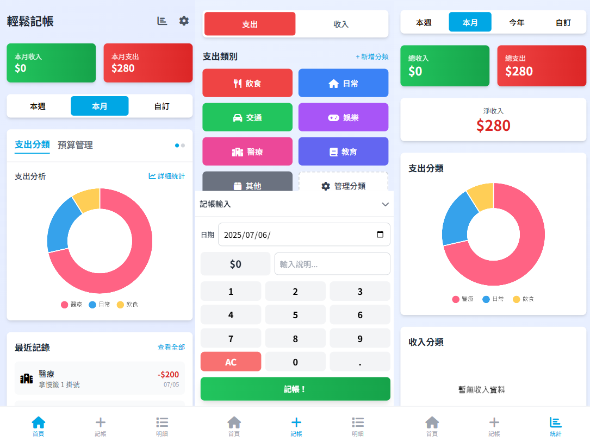

# Easy Accounting 2.0 - Modernized PWA

This is the modernized version of the "Easy Accounting" app, rebuilt with the latest frontend technologies to deliver a more beautiful, user-friendly, and robust bookkeeping experience.



📋 **[View Full Changelog](CHANGE_LOG.md)** - See detailed updates for all versions

|  |  |  |
| ------------------------------------------------------------------------------------ | ------------------------------------------------------------------------------------ | ------------------------------------------------------------------------------------ |

## 🚀 New Features & UI/UX Improvements

### ✨ Redesigned UI & Visuals

- **Modern UI**: Clean and aesthetically pleasing interface built with Tailwind CSS, enhanced with gradient backgrounds for visual depth.
- **Responsive Design**: Perfectly adapts to mobile, tablet, and desktop devices, ensuring a consistent and high-quality visual experience across all platforms.
- **Smooth Animations**: Rich interactive animations enhance usability, such as selection effects on category buttons and swipe-based page transitions.
- **Icons & Colors**: Integrated Font Awesome 6 for unified and clear icon styling. Category buttons support custom colors and provide clear visual feedback for selected states.

### 📊 Enhanced Features

- **Data Visualization**: Uses Chart.js to provide pie charts (expense breakdown) and water-level charts (budget management), allowing users to intuitively analyze income and expenses.
- **Smart Statistics**: Multi-dimensional income/expense analysis and category statistics. Quick summary features are moved to the top of the homepage for fast overviews.
- **Record Management**: Full CRUD capabilities. Fixed spacing issues in record details; same-day records display more clearly.
- **Calendar Cash Flow View & Android Desktop Widget**: The income/expense analysis page provides an intuitive monthly calendar view showing daily top 3 expense categories and amounts. Tap to open a modal with daily transaction details. Android platforms also support a desktop calendar widget for quick monthly overviews without opening the app.
- **Smart Amortization/Installments**: Integrated precise amortization/installment engine that automatically handles rounding differences for final payments, supports smart overpayment protection, and provides real-time status tracking.
- **Transaction Search**: Added search field on the details page to instantly filter records by notes or transaction amounts.
- **Account Balance Adjustment**: Added a "Balance" button on the account management page. Enter the actual balance to automatically calculate the difference, and optionally auto-create a "Reconciliation" adjustment record to maintain accurate books.
- **Monthly Budget Settings**: Set monthly expense budgets. Water-level charts dynamically show budget usage with overspend warnings. Supports checking specific expense categories for "Budget Exclusion," so actual spending in those categories is not counted in the global budget statistics.
- **Custom Categories**: Full category management features. Add custom categories, select icons and colors, and seamlessly integrate them with default categories.
- **Ledger-Independent Category Settings**: Custom category settings (including categories, sorting, and hidden items) have been refactored from globally shared to ledger-independent storage. Switching ledgers automatically reloads that ledger's exclusive category settings.
- **Smart Credit Card Management & Auto-Payment**: Supports credit card-type accounts with customizable credit limits, statement dates, and payment dates. The system automatically calculates and generates statements on or after the statement date. Supports binding regular accounts to enable "Auto-Payment." When a repayment (or transfer to pay credit card) is credited, the FIFO write-off algorithm automatically updates the statement status to paid (`paid`).
- **Shared Date Picker**: Converted the date selection modals on detail and statistics pages into a shared component, fixing previous date selection anomalies on the statistics page and ensuring consistent UI experience.
- **Swipe Gestures**: Homepage supports left/right swiping to switch between expense categories and budget management, following finger movement in real-time. Supports tab clicks and dot indicators. Smart gesture recognition prevents interference with vertical page scrolling.
- **Data Import/Export**: Full data export and import functionality with backward compatibility for older data formats, providing secure data backup and migration.
- **PWA Update Mechanism**: Smart version control and automatic update prompts to resolve PWA caching issues, ensuring users always have the latest version.
- **PWA Management Features**: Added "Force Update," "Share App," and "Install as App" options to the settings page, enhancing the PWA user experience.
- **Advanced PWA Native Integration**:
    - **Launch Handler (Single Instance Limit)**: Restricts to a single execution window (`focus-existing`) to prevent IndexedDB write deadlocks when reopening tabs.
    - **Share Target (SMS Bookkeeping)**: Supports receiving shared text from external sources, automatically extracting amounts from SMS and pre-filling them into the bookkeeping page's amount and notes fields.
    - **Edge / Windows Widget (Desktop Widget)**: Integrates with Windows desktop widget panels to display today's income/expense facts. Supports Service Worker background execution using native IndexedDB for dynamic statistics, with one-click refresh.
- **Version Management**: Settings page displays the current version number and last update time, with support for manual update checks.
- **Complete Changelog**: Built-in version update log system to view detailed update records for all historical versions.
- **Collapsible Interface**: The keypad on the bookkeeping page supports minimization. Click the keyboard icon button next to the notes field to toggle visibility, saving screen space with a compact design.
- **Smart Navigation**: Bottom navigation features a five-tab layout covering Home, Details, Bookkeeping, Statistics, and Settings, providing one-click access to core features.
- **Detailed Record Management**: Full record editing capabilities, supporting modifications to type, category, amount, description, and date.
- **Visual Enhancements**: The expense category donut chart displays the total amount in the center, providing an intuitive expense overview.
- **Homepage Widget Ordering**: Supports custom ordering of homepage widgets. Use the eye icon to toggle visibility for each widget, keeping frequently used information within reach.
- **Custom Category Feature**: Supports custom icon input, allowing the use of any Font Awesome icon class to create personalized categories.
- **Cloud Backup & Sync**: Integrated with Google Drive to support automatic backups and data synchronization across multiple devices, ensuring data security and availability anywhere.
- **Google Drive Progressive Authorization**: Cloud sync permissions are split into basic backup (`drive.appdata`) and shared ledger (`drive.file`). Initial setup only requests minimal basic permissions to protect privacy and enhance security.
- **Extension Modification API**: In the sandbox environment, plugins with `data:write` permission are granted access to `updateRecord` and `updateDebt` APIs, supporting more advanced bidirectional entity association in the database.
- **Unit Testing Infrastructure**: Introduced Vitest + jsdom to cover core business logic modules, ensuring code stability during refactoring and modifications.
- **Optimized Input Experience**: Compact bookkeeping panel design, date inputs with labels, and category selection using a unified green theme effect.

### 🧭 Navigation System

- **Bottom Navigation Bar**: Optimized five-tab navigation including "Home (🏠)", "Details (📋)", "Bookkeeping (➕)", "Statistics (📊)", and "Settings (⚙️)", providing one-click access to core features.
- **Settings Page**: Integrates data management, app management, and version info for a one-stop operational experience.

### 📱 User Interface Improvements

- **Calculator Mode & Collapsible Keypad**: The numeric keypad on the bookkeeping page has been completely upgraded.
    - Supports minimization: Click the keyboard icon button next to the notes field to toggle visibility, hiding the keypad to save screen space.
    - Built-in calculator mode: Supports direct addition, subtraction, multiplication, and division while entering amounts.
    - Settings page provides a toggle to enable/disable calculator functionality by default.
    - Automatically selects the original category when editing, enhancing user experience.
    - Optimized keypad height and spacing, providing smooth animations and hover visual feedback.
- **Compact Input Panel**: Optimized space on the bookkeeping input area.
    - Date inputs use inline layout (labels and input boxes side-by-side).
    - Unified padding and spacing design (`p-3`, `mb-3`).
    - Adjusted height for amount display and input boxes to maintain aesthetics while saving space.
    - Clear labeling system to improve usability.
- **Data Visualization**: Enhanced expense analysis charts.
    - Donut chart center displays total expenses with multi-rendering to ensure visibility.
    - Expense analysis area adds a "Detailed Statistics" quick entry.
    - Dynamic chart rendering ensures central text displays correctly.
- **Optimized Category Selection**: Unified visual feedback system.
    - Selected categories use a green gradient background with a black border.
    - Consistent design language with the successful bookkeeping state.
    - No zoom effect to maintain interface stability.
- **Custom Category & Account Icons**: Full icon customization capabilities.
    - Supports custom Font Awesome icon input and keyword search.
    - Provides over 2000 built-in FontAwesome icons for quick selection.
    - Real-time icon preview functionality.
    - Scrollable icon selection window to resolve content clipping issues.
- **Record Editing Features**: Full editing capabilities on the detailed record page.
    - Supports modifying record type (income/expense).
    - Dynamic category selector, including custom categories.
    - Complete record attribute editing (amount, description, date, category).
    - Intuitive visual feedback for selected states.
- **Enhanced Settings Page**: Redesigned settings interface.
    - Added "App" section with practical features like "Force Update," "Share App," and "Install as App."
    - Clear functional grouping and visual hierarchy, separating data management, app settings, and version info.
    - Version info card displays the current version number.

## 🛠️ Tech Stack & Development Environment

### Core Tech Stack

- **Frontend Framework**: Vanilla HTML/CSS/JS, no frameworks.
- **CSS Framework**: Tailwind CSS, providing atomic classes with high customization flexibility.
- **Chart Library**: Chart.js, used for data visualization.
- **Icon Library**: Font Awesome 6.
- **Data Storage**: Upgraded from `localStorage` to `IndexedDB`, providing more powerful asynchronous storage and query capabilities.

### Development Tools

- **Build Tool**: Vite, providing a fast development server and build functionality.
- **Code Quality**: ESLint for code linting.
- **Code Formatting**: Prettier for unified code style.

### Project Structure

```
Easy Accounting/
├── src/                    # Source code directory
│   ├── js/                # JavaScript modules
│   │   ├── main.js        # Main app (hub & routing control)
│   │   ├── dataService.js # IndexedDB data access layer
│   │   ├── ledgerManager.js # Ledger management logic
│   │   ├── categories.js  # Category constants & utility functions
│   │   ├── categoryManager.js # Custom category UI logic
│   │   ├── statistics.js  # Statistics analysis page (incl. comparison reports)
│   │   ├── recordsList.js # Bookkeeping record list
│   │   ├── budgetManager.js # Budget management
│   │   ├── quickSelectManager.js # Quick selection management
│   │   ├── debtManager.js  # Debt management
│   │   ├── changelog.js   # Version update log
│   │   ├── datePickerModal.js # Shared date picker modal
│   │   ├── pluginManager.js # Extension system
│   │   ├── pluginStorage.js # Plugin sandbox storage
│   │   ├── syncService.js # Google Drive cloud sync
│   │   ├── rewardService.js # Cross-platform ad service
│   │   ├── router.js      # Routing management
│   │   ├── utils.js       # Shared utility functions
│   │   └── pages/         # Page components directory (Home, Accounts, Ledgers, Split, etc.)
│   ├── css/               # Style files
│   │   └── main.css       # Main styles
│   └── index.html         # Development HTML
├── tests/                  # Test code directory
│   └── unit/              # Unit tests (20+ test files covering core business logic)
├── public/                # Public assets
│   ├── manifest.json      # PWA configuration
│   └── serviceWorker.js   # Service Worker
├── package.json           # Project configuration
├── vite.config.js         # Vite configuration
└── index.html             # Entry file
```

### Development Environment Setup

1.  **Install Dependencies**:
    ```bash
    npm install
    ```
2.  **Development Mode**:
    ```bash
    npm run dev
    ```
    This starts the Vite dev server, typically at `http://localhost:3000`.
3.  **Build Production Version**:
    ```bash
    npm run build
    ```
4.  **Preview Production Version**:
    ```bash
    npm run preview
    ```
5.  **Lint Code**:
    ```bash
    npm run lint
    ```
6.  **Format Code**:
    ```bash
    npm run format
    ```
7.  **Run Unit Tests**:

    ```bash
    # Run all tests once
    npx vitest run

    # Start watch mode
    npx vitest
    ```

### 🤖 Android Development (Capacitor)

> [!IMPORTANT]
> Before running any Capacitor sync commands, **you must build first** (`npm run build`). Capacitor packages the `dist/` directory into the Android project and does not accept HMR output from the dev server.

#### Daily Development Sync Workflow (Most Common)

After modifying web code, run sequentially:

```bash
# 1. Build web artifacts
npm run build

# 2. Sync dist/ into the android/ native project
npx cap sync android

# 3. Open Android Studio (optional, if inspecting native layer)
npx cap open android
```

If only web assets (HTML/CSS/JS) were modified and native modules don't need recompilation, use the faster `copy`:

```bash
npm run build && npx cap copy android
```

#### Common Commands Quick Reference

| Command                     | Description                                                                 |
| ------------------------ | -------------------------------------------------------------------- |
| `npx cap sync android`   | Full sync: Copies web assets **+** updates native plugins (recommended after dependency changes) |
| `npx cap copy android`   | Only copies web assets, skips plugin updates (faster)                            |
| `npx cap open android`   | Opens native project in Android Studio                                       |
| `npx cap run android`    | Runs directly on connected device / emulator (requires ADB)                          |
| `npx cap update android` | Updates native plugins to latest version (use after `npm update`)                        |
| `npx cap doctor`         | Checks if Capacitor environment is correctly configured                                      |

#### Full First-Time Build Workflow

First-time Android APK build in a new environment:

```bash
# 1. Install Node dependencies
npm install

# 2. Build web end
npm run build

# 3. Sync to Android project (incl. plugins)
npx cap sync android

# 4. Open Android Studio, then Build → Generate Signed APK inside Studio
npx cap open android
```

#### Capacitor Configuration Details

Project config file: [`capacitor.config.json`](capacitor.config.json)

```json
{
    "appId": "com.walkingfish.easyaccounting",
    "appName": "Easy Accounting",
    "webDir": "dist"
}
```

- `webDir: "dist"` — Capacitor reads web assets from this directory, so **building is a prerequisite for syncing**.
- `androidScheme: "https"` — Allows WebView to load local resources via HTTPS, avoiding mixed content errors.

## 🎨 Appearance Theme System

Easy Accounting provides a complete theme system, allowing developers to define visual styles via JSON without modifying any code.

### How Themes Work

- **A theme is a `.json` file** located in the `public/themes/` directory.
- The system reads the theme, injects colors into global CSS variables (`--wabi-*`), and uses a `MutationObserver` to continuously replace specified icons in the DOM.
- Themes can be installed via "Settings → Appearance Theme → Theme Store" or imported directly as `.json` files.

### Theme JSON Structure Summary

```json
{
    "id": "com.yourname.themename",
    "name": "Theme Name",
    "version": "1.0",
    "author": "Author",
    "colors": {
        "wabi-primary": "#...",
        "wabi-bg": "#...",
        "wabi-surface": "#...",
        "wabi-keypad": "#..."
    },
    "icons": {
        "nav#bottom-nav a[data-page='add'] i.fa-plus": {
            "type": "svg",
            "svg": "<svg ...>...</svg>",
            "className": "w-8 h-8"
        }
    }
}
```

> **Full Development Docs** → See **[THEME_DEV_GUIDE.md](THEME_DEV_GUIDE.md)**

### Built-in Themes

| Theme ID                           | Name       | Features                          |
| --------------------------------- | ---------- | ----------------------------- |
| `com.walkingfish.theme.dark`      | Dark Mode   | Eye-friendly dark theme, auto-updates, cannot be deleted  |
| `com.walkingfish.theme.sakura`    | Sakura Pink     | Pink color scheme + custom 5-petal flower SVG icons |
| `com.walkingfish.theme.ocean`     | Deep Ocean Blue   | Calm blue color scheme                    |
| `com.walkingfish.theme.cyberpunk` | Cyberpunk   | Neon yellow/pink/cyan interplay            |
| `com.walkingfish.theme.hightech`  | High-Tech Hacker | Matrix black/green code style             |

### Theme Store Entries (`public/themes/index.json`)

Each theme requires additional information in the store:

```json
{
    "id": "...",
    "file": "themes/yourtheme.json",
    "svgPreview": "<svg>...</svg>",
    "iconPreview": "fa-solid fa-moon",
    "colorsPreview": {
        "bg": "#...",
        "primary": "#..."
    }
}
```

- `svgPreview` (preferred): Uses an SVG string as the store card thumbnail. The system uses the primary color as the background and displays the icon in white.
- `iconPreview`: Uses a FontAwesome class, displayed with background color + primary color text.
- If both are missing, it falls back to a color dot display.
- `colorsPreview` provides preview color blocks, displaying up to 5 colors.

## 🔄 Data Migration

The new version automatically detects and migrates data from older versions:

1.  Detects `AllTheData` in `localStorage`.
2.  Automatically converts the format and imports it into `IndexedDB`.
3.  Backs up original data as `AllTheData_backup`.
4.  Clears old `localStorage` data.

## 🔧 Troubleshooting & Fixes

### Fixed Issues

- `getDateRange is not defined` error: `getDateRange` is now correctly imported in `main.js`.
- `Cannot read properties of null (reading 'classList')` error: Existence checks added before all DOM operations.
- IndexedDB compatibility issues: Added `localStorage` fallback mechanism.
- Chart duplicate rendering issue: Added chart instance management; old charts are destroyed before rendering.
- Icon display issue: Changed icon display from `${categoryIcon}` to `<i class="${categoryIcon}"></i>` in all relevant locations.
- Category button styling issue: Used inline styles to force overrides, ensuring styles apply correctly.

### FAQ

- **Homepage chart not displaying?** Ensure there is bookkeeping data. New users will see "No expense records this month."
- **Donut chart center missing total amount?** Wait for chart loading to complete, or refresh the page to re-render the chart.
- **Custom categories missing?** Custom categories are stored in `localStorage`. Clearing browser data will cause them to be lost.
- **Budget settings not working?** Verify settings were saved correctly. Reconfigure the budget.
- **Chart displaying abnormally?** Refresh the page; the chart will re-render.
- **Keypad cannot be minimized?** Ensure you are on the bookkeeping page. Click the keyboard icon button (⌨️) next to the notes field to toggle visibility.
- **Cannot modify category when editing records?** In the edit modal, select the type (income/expense) first, then select the corresponding category.
- **Cannot find statistics page?** The statistics feature has a dedicated bottom navigation tab (📊 Statistics). Tap it directly to access detailed analysis.
- **Custom icons not displaying?** Ensure the correct Font Awesome class name is entered (e.g., `fas fa-heart`). Use the preview feature to verify.
- **Add category window clipped?** The window now supports scrolling. Scroll to view all content and options.
- **Homepage cannot scroll?** Swiping up/down in the slider area now scrolls the page normally without interfering with gesture recognition.
- **Category not pre-selected when editing records?** The system now automatically selects the record's original category, no need to reselect.
- **No visual feedback for category selection?** Selected categories display a green gradient background and black border to confirm correct selection.
- **Bookkeeping panel too large?** The panel has been optimized to a compact design. Click the title bar to minimize it and save more space.
- **Check update not responding?** Check your network connection, or refresh the page and try again.
- **Version info incorrect?** Version info is read from within the app. If there are issues, clear your browser cache.
- **Features malfunctioning after update?** Try clearing your browser cache or reinstalling the PWA.

## 📥📤 Data Management

### Data Export Features

- **One-click Export**: Tap the settings button in the top-right corner of the homepage → Export Data.
- **Format Support**: JSON format, including complete bookkeeping records and metadata.
- **File Naming**: Automatically named with the date (e.g., `Bookkeeping Data_2024-01-15.json`).
- **Data Integrity**: Includes version info, export date, total record count, and other metadata.

### Data Import Features

- **Backward Compatibility**: Fully supports automatic conversion of older data formats.
- **Format Detection**: Automatically identifies new and old data formats.
- **Data Validation**: Validates data integrity before import, filtering out invalid records.
- **Safety Confirmation**: Prompts for confirmation before overwriting existing data.
- **Error Handling**: Provides friendly error messages and handling suggestions.

### Version Management Features

- **Version Info Display**: Settings page shows current app version number and last update time.
- **Manual Update Check**: Tap "Check for Updates" to actively look for new versions.
- **Update Status Prompts**: Smartly identifies and prompts different update statuses:
    - 🆕 New version found → Shows update prompt banner.
    - ⬇️ Downloading new version → Shows download progress.
    - ✅ Already up to date → Confirmation message.
    - ❌ Check failed → Error prompt and suggestions.
- **Automatic Time Logging**: Automatically records update timestamps after each update.

### Usage Instructions

1. **Export Data**: Settings Page → Data Management → Export Data
2. **Import Data**: Settings Page → Data Management → Import Data → Select File
3. **Check for Updates**: Settings Page → About → Check for Updates
4. **View Version Log**: Settings Page → About → Update Log
5. **App Management**: Settings Page → App → Tap "Force Update", "Share App", or "Install as App"

## 🔄 PWA Update Mechanism

### Smart Version Control

- **Auto-Detection**: The app automatically detects the availability of new versions.
- **Version Management**: Uses semantic versioning (e.g., v2.1.0.2) for version control.
- **Cache Strategy**: Employs a multi-layer caching strategy to ensure update reliability.

### Update Flow

1. **Detect Update**: When a new version is available, it automatically downloads in the background.
2. **User Notification**: Displays a blue update banner prompting that a new version is available.
3. **Choose Update**: Users can choose "Update Now" or "Update Later".
4. **Auto-Reload**: Automatically reloads the page to use the new version after the update completes.
5. **Manual Update**: Users can go to the "Settings" page and tap "Force Update" to manually clear the cache and reload.

### Installation & Sharing

- **Install Prompt**: The "Settings" page provides an "Install as App" button to guide users in installing the site as a PWA. This button automatically hides after installation.
- **App Sharing**: The "Settings" page provides a "Share this App" button, making it easy for users to recommend it to friends via native sharing features.

### System Integration & Advanced Capabilities

- **Single Instance (Launch Handler)**: Restricts the PWA to a single execution window. Tapping the icon automatically focuses on the already launched instance, preventing multi-window write conflicts.
- **Web Share Receiver (Share Target)**: Receives text from external apps (e.g., bank swipe SMS), automatically parses consumption amounts using regex and imports them into bookkeeping notes for instant recording.
- **Edge Desktop Widgets**: Integrates with Windows 11 Widget Board. Uses Microsoft Adaptive Cards to define UI, calls IndexedDB in the background to calculate today's income/expense facts, and provides quick bookkeeping and manual refresh.

### Cache Management

- **Versioned Cache**: Each version uses an independent cache space.
- **Auto-Cleanup**: Automatically clears old version caches during updates.
- **Smart Strategy**:
    - **Network First**: JS/CSS files prioritize fetching the latest version from the network.
    - **Cache First**: Static resources like images prioritize using the cache.
    - **Offline Support**: Falls back to cached versions when the network is unavailable.

### Developer Update Guide

To release a new version, simply:

1. Modify the `version` field in `package.json`.
2. Run `npm run build`.
3. The build process automatically injects the version number into JS files in `src/js/` and `dist/serviceWorker.js`.
4. Deploy the app. Users will automatically detect and be prompted to update upon visiting.

> [!NOTE]
> With the new "single-source version injection" mechanism, manual modification of the version number in `serviceWorker.js` is no longer required.

### Resolved Issues

- ✅ **PWA Caching Issues**: Completely resolved the issue where installed PWAs couldn't update.
- ✅ **User Experience**: Provides friendly update prompts and choice options.
- ✅ **Auto-Management**: No need to manually clear cache or reinstall.
- ✅ **Instant Effect**: Latest features are available immediately after updating.
- ✅ **Offline Compatibility**: Maintains offline functionality while ensuring timely updates.

## 📈 Future Plans

- [x] Cloud backup & sync
- [x] Multi-account support
- [x] Dark mode
- Multi-language support
- [x] Push notifications (daily reminders)
- More chart types

## 📚 Related Docs

- **[View Full Changelog](CHANGE_LOG.md)** - See detailed update records for all versions

## 🤝 Contribution

Feel free to submit Issues and Pull Requests to improve this project!

## 📄 License

MIT License

---

**Easy Accounting 2.0** - Making bookkeeping simpler, more beautiful, and smarter!
