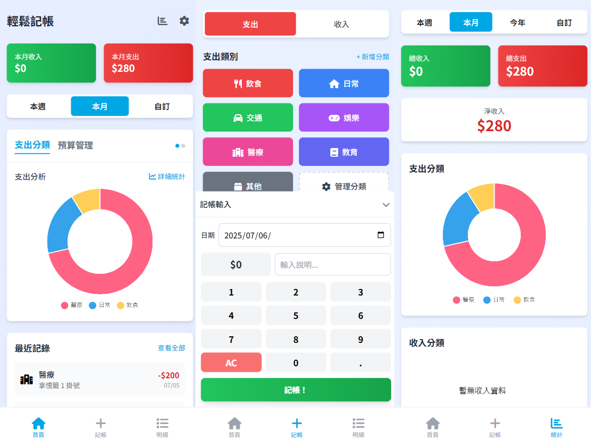

# Easy Accounting 2.0 - Modern PWA

[繁體中文](README.md) | [English](README_en.md)

**Easy Accounting 2.0** is a modern, high-performance, offline-first Progressive Web Application (PWA) built from the ground up with native Web Standards, Tailwind CSS, and IndexedDB. It delivers an intuitive, elegant, and secure personal finance management experience across mobile, tablet, and desktop devices.



📋 **[View Change Log](CHANGE_LOG.md)** | 📖 **[Per-Device Sync Technical Specification](docs/PER_DEVICE_SYNC_en.md)**

|  |  |  |
| ------------------------------------------------------------------------------------ | ------------------------------------------------------------------------------------ | ------------------------------------------------------------------------------------ |

---

## 🌟 Highlights & Key Features

### 🔄 Multi-User Shared Ledgers & Per-Device Cloud Sync
- **Per-Device Append-Only Log Architecture**: Each device writes strictly to its dedicated cloud change log (`sync_shared_devlog_<uuid>`), fundamentally eliminating Last-Write-Wins overwrites, merge conflicts, and data loss during concurrent multi-user accounting.
- **Manifest Coordination with CAS Optimistic Locking**: A central manifest registry (`EasyAccounting_SharedManifest_<uuid>.json`) tracks all participating devices and emails. Membership changes employ Google Drive ETag / If-Match compare-and-swap (CAS) concurrency control with automatic retry.
- **Google Drive Permission Closed-Loop**: When inviting collaborators, read access is granted to both the manifest and the owner's devlog. When removing members, permissions are automatically revoked on Google Drive, enforcing least privilege and fail-closed security.
- **Permanent Local `appliedKeys` Deduplication**: Remote changes are tracked and deduplicated via persisted cryptographic change keys without arbitrary time cutoffs, eliminating phantom record resurrection and clock-drift synchronization drops.
- **Progressive OAuth Scope Elevation**: Requires only minimal `drive.appdata` for personal backup, elevating to `drive.file` only when shared ledgers are created or joined.

### 🤖 On-Device AI Voice & Semantic Accounting
- **100% Offline AI Assistant**: Runs a quantized 58M Small Language Model (SLM) directly in the browser via WebAssembly (`wllama` / WASM) with Origin Private File System (OPFS) model weight caching—zero server roundtrips, total financial privacy.
- **Semantic Guardrail Calibration (`applySemanticGuardrail`)**: Frontend heuristic guardrails intercept common colloquial speech (e.g. "spent \$100", "bought lunch") to eliminate LLM hallucinations that might misclassify expenses as income.
- **Graceful Fallback Rule Engine**: Built-in deterministic regex and NLP parser ensures seamless instant classification even before the AI model finishes loading.

### 💳 Real Credit Card Installments & Smart Amortization
- **Upfront Full-Limit Impact**: Credit card installments immediately record the full liability and deduct available credit limit upfront upon purchase.
- **Automatic Monthly Transfer Repayments**: System automatically generates monthly "Debit Account Expense + Credit Card Income" transfer pairs, releasing occupied credit limit month by month.
- **Rounding Adjustment & Overpayment Protection**: Handles odd-cent penny rounding differences in the final installment period and safeguards against duplicate automatic repayments.

### 🎨 Theme System & Native Dark Mode
- **Quad-State Appearance Modes (`THEME_MODES`)**:
  - `system`: Dynamically tracks OS `prefers-color-scheme` in real time.
  - `light`: Clean, warm Wabi-sabi aesthetic.
  - `dark`: Eye-friendly high-contrast dark theme.
  - `custom`: Supports imported community JSON themes and in-app Theme Store packages.
- **Status Bar & UI Integration**: Automatically synchronizes mobile browser status bars via `<meta name="theme-color">` and sanitizes custom SVG/CSS inputs against injection attacks.

### 👥 Group Expenses & Debt Splitting
- **Project & Event Splitting**: Create independent expense groups (e.g., travel, shared apartment, events).
- **Single-Item Settlement & Batch Clearance**: Settle individual shared transactions or execute one-click full clearance (`settleGroupRecord`), with automatic reverse balance adjustments.

### 📱 PWA & Platform Integrations
- **Zero Third-Party CDN at Initial Paint**: All assets (Tailwind CSS, Font Awesome, Google Fonts, QRCode.js) are bundled locally. Service Worker precaches all runtime dependencies (`precachemanifest.json`) for true 100% offline availability.
- **Launch Handler**: Single-instance lock (`focus-existing`) prevents multi-tab race conditions and IndexedDB write deadlocks.
- **Web Share Target**: Parses incoming transaction SMS messages from bank notifications and pre-fills accounting forms automatically.
- **Desktop & Native Widgets**:
  - **Android Widget**: Native desktop widget for calendar cash flow overview and quick expense entry.
  - **Windows 11 Widget Board**: Adaptive Cards integration querying local IndexedDB via background Service Worker.

---

## 🏗️ Architecture & Technical Stack

### Core Technology Stack
- **Runtime**: Native ES Modules (Vanilla JavaScript), HTML5, CSS3.
- **Styling**: Tailwind CSS (PostCSS pipeline).
- **Data Persistence**: IndexedDB (Schema v15) with asynchronous abstraction layer (`DataService`).
- **Data Visualization**: Chart.js for donut breakdown and budget water-level gauges.
- **Icons**: Font Awesome 6 (embedded SVG/WebFonts).
- **Mobile Container**: Capacitor 7 (Android SDK 35).
- **Testing**: Vitest + jsdom (38 test suites, 1,687 automated unit tests).
- **Bundler**: Vite with custom version injection and PWA manifest generation.

### Project Directory Structure

```
├── android/                 # Capacitor Android native project
│   ├── app/src/main/        # Native AndroidManifest, Java bridge & AdMob
│   └── variables.gradle     # SDK version definitions (minSdk=23, targetSdk=35)
├── src/
│   ├── js/
│   │   ├── main.js          # App lifecycle hub, routing, amortizations runner
│   │   ├── dataService.js   # IndexedDB data access layer (Schema v15)
│   │   ├── syncService.js   # Per-Device Sync engine & Google Drive integration
│   │   ├── ledgerManager.js # Ledger lifecycle, sharing, permission ACL management
│   │   ├── groupManager.js  # Expense group splitting and settlement
│   │   ├── themeManager.js  # Theme management, dynamic dark mode & SVG sanitization
│   │   ├── aiService.js     # On-device WASM LLM inference & semantic guardrails
│   │   ├── statistics.js    # Multi-dimensional analytics & trend calculations
│   │   ├── comparisonReport.js # Period-over-period comparative financial reports
│   │   ├── calendarCashFlow.js # Monthly cash flow calendar grid
│   │   ├── recordsList.js   # Transaction list rendering, filtering & search
│   │   ├── budgetManager.js # Monthly budgets, rollover, category exclusions
│   │   ├── debtManager.js   # Debts, loans, and contact ledger tracking
│   │   ├── tourManager.js   # Interactive onboarding and guided tutorials
│   │   ├── widgetHelper.js  # Android widget data aggregation and export
│   │   ├── utils.js         # Shared utilities (currency formatters, XSS escape)
│   │   └── pages/           # Modular view controllers
│   ├── css/
│   │   └── main.css         # Tailwind directives and custom component styles
│   └── index.html           # Single Page Application HTML entry point
├── tests/
│   └── unit/                # Automated unit tests (38 test files, 1,687 tests)
├── public/
│   ├── themes/              # Built-in and downloadable themes
│   ├── manifest.json        # Web App Manifest
│   └── serviceWorker.js     # Versioned Service Worker cache manager
├── docs/
│   └── PER_DEVICE_SYNC_en.md # Deep-dive technical specification for Per-Device Sync
├── vite.config.js           # Build configuration and cache manifest injector
└── package.json             # Project metadata, dependencies and scripts
```

### IndexedDB Storage Schema (Database: `easy-accounting-db`, Version: 15)

| Store Name | KeyPath | Description |
|------------|---------|-------------|
| `records` | `id` (autoIncrement) | Income, expense, and transfer transactions |
| `accounts` | `id` (autoIncrement) | Cash, bank, credit card, and e-wallet accounts |
| `categories` | `id` | Standard and custom expense/income categories |
| `ledgers` | `id` (autoIncrement) | Multi-ledger definitions, icons, colors, UUIDs |
| `debts` | `id` (autoIncrement) | Receivables and payables linked to contacts |
| `contacts` | `id` (autoIncrement) | Contact profiles for debts and group splits |
| `amortizations` | `id` (autoIncrement) | Installment plans and amortization schedules |
| `groupMeta` | `id` (autoIncrement) | Expense sharing group definitions and members |
| `credit_statements`| `id` (autoIncrement) | Locally derived monthly credit card billing statements |
| `settings` | `key` | Key-value application configurations and sync metadata |
| `theme` | `id` | Active and cached theme configurations |
| `pluginState` | `id` | Installed plugin states and sandbox storage |

---

## 🛠️ Getting Started & Development

### Prerequisites
- **Node.js**: v18.0.0 or later (LTS recommended).
- **npm**: v9.0.0 or later.
- **Android Studio** (optional, required only for native Android APK compilation).

### Quick Start

1. **Clone the repository**:
   ```bash
   git clone https://github.com/ADT109119/jijun.git
   cd jijun
   ```

2. **Install dependencies**:
   ```bash
   npm install
   ```

3. **Start local development server**:
   ```bash
   npm run dev
   ```
   Open your browser at `http://localhost:3000`.

4. **Run unit tests**:
   ```bash
   # Single execution (1,687 tests across 38 suites)
   npx vitest run

   # Watch mode for active development
   npx vitest
   ```

5. **Lint and format code**:
   ```bash
   npm run lint
   npm run format
   ```

6. **Build for production**:
   ```bash
   npm run build
   ```
   The compiled static bundle will be output to the `dist/` directory with automatic Service Worker precache injection.

---

## 🤖 Android Native Development (Capacitor)

> [!IMPORTANT]
> Always execute `npm run build` prior to running Capacitor synchronization commands. Capacitor consumes assets directly from `dist/`.

```bash
# 1. Build the web distribution
npm run build

# 2. Sync web assets and update native plugins
npx cap sync android

# 3. Open Android Studio
npx cap open android
```

### Fast Web Asset Update
If only web files (`src/`) were updated without plugin changes:
```bash
npm run build && npx cap copy android
```

> [!TIP]
> **Windows Development Note**: If compiling inside a virtualized Windows OneDrive directory using Node.js v24+, file system virtualization attributes may trigger an `EPERM -4094 (UNKNOWN)` copy error. Move the project folder outside OneDrive or use Node.js LTS (v20/v22).

---

## 🔒 Security & Privacy Architecture

- **Zero Remote Database**: All financial records reside inside your browser's private IndexedDB instance.
- **No Third-Party Telemetry**: Your financial figures are never transmitted to external analytics or advertising servers.
- **Direct Cloud Sync**: Data synchronized via Google Drive communicates exclusively between your device and Google's official Drive API endpoints using OAuth 2.0 PKCE tokens.
- **Input Sanitization**: All user-controlled text rendered into the DOM passes through `escapeHTML()` and strict SVG parsers to safeguard against Cross-Site Scripting (XSS).

---

## 📚 Related Documentation

- **[Per-Device Sync Architecture Specification](docs/PER_DEVICE_SYNC_en.md)** - Deep technical specification of the multi-user sync protocol
- **[Chinese Documentation (繁體中文說明文件)](README.md)** - Traditional Chinese project documentation
- **[Full Change Log](CHANGE_LOG.md)** - Comprehensive history of updates and releases
- **[Theme Development Guide](THEME_DEV_GUIDE.md)** - Guide for creating custom themes
- **[Plugin Development Guide](PLUGIN_DEV_GUIDE.md)** - Extension API and sandbox architecture

---

## 🤝 Contributing

Contributions, issues, and feature requests are welcome! Feel free to check the [issues page](https://github.com/ADT109119/jijun/issues).

## 📄 License

This project is licensed under the [MIT License](LICENSE).
